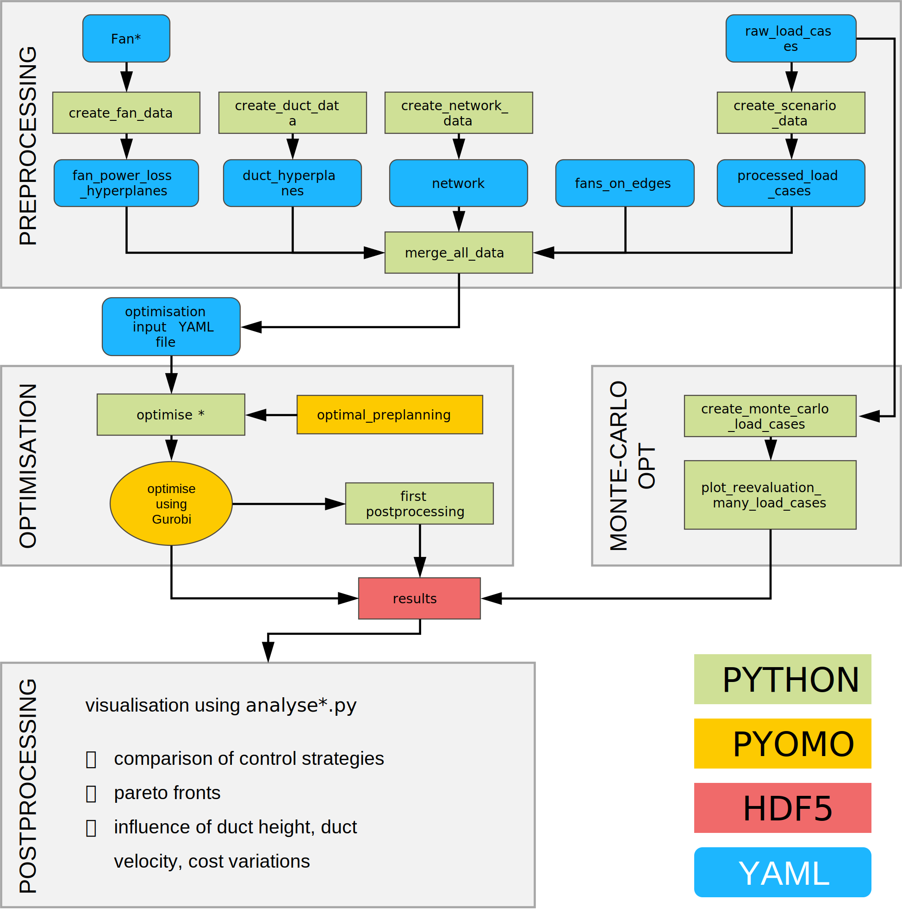

# Algorithmic Planning of Ventilation Systems

Code used for the dissertation *Algorithmische Systemplanung raumlufttechnischer Anlagen*.

This repository contains the optimisation, preprocessing, postprocessing, and plotting code for algorithmic system planning of ventilation systems. It extends the earlier topology-optimisation code base by also including configuration optimisation. The framework covers duct sizing, fan placement, fan operation, control strategy selection, load-case generation, acoustic postprocessing, and result evaluation.

The repository is intended as a research companion to the dissertation. It provides the code and input structures used to generate, evaluate, and visualise the optimisation results.

## Related packages

The following packages are required and are installed through `requirements.txt`:

- `pyomo2h5`: reading and writing YAML and HDF5 optimisation result files
- `underestimating-hyperplanes`: relaxation of fan characteristic curves and duct pressure losses
- `vensys-clustering`: generation and reduction of ventilation load cases

All three packages are maintained under the same GitHub user and are referenced directly in `requirements.txt`.

## Installation

The repository itself is currently structured as research code and not an installable Python package. Therefore, the recommended workflow is to clone the repository, install the requirements, and run scripts from the repository root.

```bash
git clone https://github.com/jhpb7/algorithmic_planning_of_ventilation_systems.git
cd algorithmic_planning_of_ventilation_systems

python -m venv .venv
source .venv/bin/activate

pip install -r requirements.txt
```

## Overview

The repository provides:

- YAML input files for ventilation networks, fans, ducts, load cases, and optimisation cases
- preprocessing scripts for fan data, duct data, network data, load cases, and merged model input files
- Pyomo optimisation models for topology and configuration optimisation
- optimisation scripts for different buildings, control strategies, duct constraints, and real-ductwork cases
- postprocessing scripts and notebooks for analysing HDF5 optimisation results
- plotting notebooks for figures used in the dissertation
- Monte-Carlo and quasi-Monte-Carlo based reevaluation workflows for load-case studies

The repository uses the following names for the three buildings from the PhD thesis:
GPZ = Multifunktionsgebäude, OFF = Büroturm, LAB = Laborgebäude.

## Repository structure

```text
yaml_opt_input_files/      Optimisation input files

data/
├── duct_data/             Preprocessed duct approximations
├── fan_data/              Fan data and fan approximations
├── load_case_data/        Raw, reduced, clustered, and sampled load cases
├── network_data/          Network definitions and fan-edge mappings
└── vfc_sil_data/          Volume-flow-controller and silencer data

src/
├── preprocessing/         Input generation and preprocessing
├── pyomo_models/          Pyomo model formulation
├── optimise/              Optimisation scripts
├── postprocessing/        Result evaluation and plotting workflows
└── debugging/             Development and debugging scripts
```

## Input data

The optimisation workflow is based on YAML input files. Important input groups are:

- `fan_data.yml`: fan characteristic data and fan approximation data
- `duct_data.yml`: duct dimensions, constraints, pressure-loss approximations, and acoustic data
- `network_data.yml`: ventilation network topology, nodes, edges, rooms, component placement, fixed component data, acoustic data
- `load_case_data.yml`: room-wise volume-flow demands and time shares
- `fans_on_edges.yml`: possible fan positions in the network
- `yaml_opt_input_files/*.yml`: complete optimisation case definitions

The repository contains input data for the considered case studies, including office-building and multi-purpose-building variants.

## Load-case generation

Load cases can be generated and evaluated in several ways:

- deterministic load cases based on normative mean values
- clustered load cases using Wasserstein-distance-based clustering (not part of the dissertation)
- Monte-Carlo or quasi-Monte-Carlo load cases sampled from room-wise demand distributions
- reevaluation load cases for analysing power consumption and robustness under many sampled demand states

The sampled load cases in `data/load_case_data/` are used for reevaluation and comparison of optimisation results. Sobol sampling is used for quasi-Monte-Carlo generation in parts of the workflow.

## Preprocessing

Preprocessing scripts convert the individual input files into model-ready optimisation data.

Typical steps are:

```bash
python -m src.preprocessing.create_duct_data
python -m src.preprocessing.create_fan_data_w_acoustics
python -m src.preprocessing.create_scenario_data
python -m src.preprocessing.merge_all_data
```

Network files for the case studies are generated using scripts in:

```text
src/preprocessing/create_network_files/
```

The output of preprocessing is a merged YAML file that can be used to instantiate the optimisation model.

## Optimisation

The optimisation model is implemented in:

```text
src/pyomo_models/optimal_planning.py
```

The model is formulated in Pyomo and solved with Gurobi. The main optimisation scripts are located in:

```text
src/optimise/
```

Important scripts include:

- `optimise_topo_config_all_cs.py`: topology and configuration optimisation for multiple control strategies
- `optimise_topo_config_duct_variations.py`: optimisation with duct-constraint variations
- `optimise_topo_config_real_GPZ.py`: optimisation for the real-ductwork case

The optimisation output is written to HDF5 files using `pyomo2h5`. These files contain model components, solver information, decision variables, objective values, and postprocessed quantities.

## Postprocessing and plotting

Postprocessing code is located in:

```text
src/postprocessing/
```

The notebooks in `src/postprocessing/plot_result_figures/` were used to create dissertation result figures. Some plotting notebooks require HDF5 result files to be selected manually. This is intentional: large optimisation result files are not stored directly in the repository but are provided through the accompanying research data publication ().

The plotting code is therefore meant to document and reproduce the figure-generation workflow, not to provide a fully automated plotting command-line interface.

## Workflow overview

The detailed workflow use to preprocess, optimise and postprocess is as follows:




## Reproducing dissertation results

This repository contains the code and input structures used for the dissertation. Large HDF5 result files and figure metadata may be stored externally in the accompanying research data publication. To reproduce a result figure, load the corresponding HDF5 result files or JSON figure metadata into the relevant plotting notebook.

A typical workflow is:

1. Prepare the YAML input files.
2. Run preprocessing to generate optimisation input YAML file.
3. Run the optimisation script for the selected case study and control strategy.
4. Save optimisation results with `pyomo2h5`.
5. Use the postprocessing notebooks to analyse the HDF5 files and generate figures.

## Notes on dependencies

Gurobi is required for the optimisation runs used in the dissertation. A working Gurobi installation and license are therefore needed to solve the optimisation models. The Python package `gurobipy` is listed in `requirements.txt`, but the solver license must be configured separately.

The packages installed from GitHub in `requirements.txt` are required for the full workflow. If installation fails, install them manually, for example:

```bash
pip install git+https://github.com/jhpb7/pyomo2h5.git
pip install git+https://github.com/jhpb7/underestimating-hyperplanes.git
pip install git+https://github.com/jhpb7/vensys-clustering.git
```

## Note on AI usage

Parts of this repository, including documentation and code snippets, were prepared with the assistance of ChatGPT 5. All outputs were reviewed and validated by the author.

## Funding

The presented results were obtained within Julius Breuer's dissertation *Algorithmische Systemplanung raumlufttechnischer Anlagen*. Part of which was produced within the research project “Algorithmic System Planning of Air Handling Units”, Project No. 22289 N/1, funded by the program for promoting Industrial Collective Research (IGF) of the German Ministry for Economic Affairs and Climate Action (BMWK), approved by the Deutsches Zentrum für Luft- und Raumfahrt (DLR). 

## License

This repository is released under the license specified in `LICENSE`.
